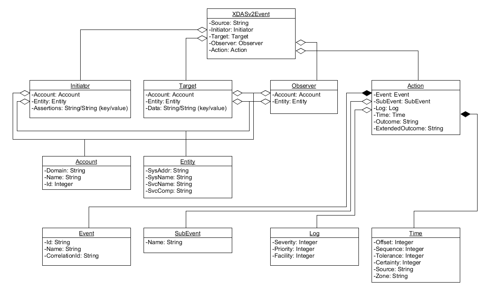

XDASv2Net
=========

XDASv2Net is a .NET library containing the model of the XDASv2 specification. 
The XDASv2 specification provides a standardized classification for audit events. It defines a set of
generic events at a global distributed system level. XDASv2 provides a common portable audit record
format to facilitate the merging and analysis of audit information from multiple components at the
distributed system level. The XDASv2 events are encapsulated within a hierarchical notational
system that helps to extend the standard or existing event identifier set. The XDASv2 taxonomy
defines a set of fields, of these the primary fields are observer, initiator and target. XDASv2 events
helps you easily understand the audit trails of heterogeneous applications.

[Source](https://www.netiq.com/documentation/edir88/pdfdoc/edirxdas_admin/edirxdas_admin.pdf)

## XDASv2 UML class diagram


## XDASv2 JSON Schema
```json
{
  "id": "XDASv2",
  "title": "XDAS Version 2 JSON Schema",
  "description": "A JSON representation of an XDASv2 event record.",
  "type": "object",
  "properties": {
    "Source": {
      "description": "The original source of the event, if applicable.",
      "type": "string",
      "optional": true
    },
    "Observer": {
      "description": "The recorder (ie., the XDASv2 service) of the event.",
      "type": "object",
      "optional": false,
      "properties": {
        "Account": { "$ref": "#/account" },
        "Entity": { "$ref": "#/entity" }
      }
    },
    "Initiator": {
      "description": "The authenticated entity or access token that causes an event.",
      "type": "object",
      "optional": false,
      "properties": {
        "Account": {
          "$ref": "#/account",
          "optional": true
        },
        "Entity": { "$ref": "#/entity" },
        "Assertions": {
          "description": "Attribute/value assertions about an identity.",
          "type": "object",
          "optional": true
        }
      }
    },
    "Target": {
      "description": "The target object, account, data item, etc of the event.",
      "type": "object",
      "optional": true,
      "properties": {
        "Account": { "$ref": "#/account" },
        "Entity": { "$ref": "#/entity" },
        "Data": {
          "description": "A set attribute/value pairs describing the target object.",
          "type": "object",
          "optional": true
        }
      }
    },
    "Action": {
      "description": "The action describes the event in a uniform manner.",
      "type": "object",
      "optional": false,
      "properties": {
        "Event": {
          "description": "The event identifier in standard XDASv2 taxonomy.",
          "type": "object",
          "optional": false,
          "properties": {
            "Id": {
              "description": "The XDASv2 taxonomy event identifier.",
              "type": "string",
              "optional": false,
              "pattern": "/^[0-9]+(\.[0-9]+)*$/" 
            },
            "Name": {
              "description": "A short descriptive name for the specific event.",
              "type": "string",
              "optional": true
            },
            "CorrelationID": {
              "description": "Correlation ID, source#uniqueID#connID",
              "type": "string",
              "optional": true
            }
          },
          "SubEvent": {
            "type": "object",
            "description": "Describes the actual domain specific event that has occured.",
            "optional": true,
            "properties": {
              "Name": {
                "description": "A short descriptive name for this event.",
                "type": "string",
                "optional": true
              }
            }
          }
        },
        "Log": {
          "description": "Client-specified logging attributes.",
          "optional": true,
          "properties": {
            "Severity": {
              "type": "integer",
              "optional": true
            },
            "Priority": {
              "type": "integer",
              "optional": true
            },
            "Facility": {
              "type": "integer",
              "optional": true
            }
          }
        },
        "Outcome": {
          "description": "The XDASv2 taxonomy outcome identifier.",
          "type": "string",
          "optional": false,
          "pattern": "/^[0-9]+(\.[0-9]+)*$/"
        },
        "Time": {
          "description": "The time the event occurred.",
          "type": "object",
          "optional": false,
          "properties": {
            "Offset": {
              "description": "Seconds since Jan 1, 1970.",
              "type": "integer"
            },
            "Sequence": {
              "description": "Milliseconds since last integral second.",
              "type": "integer",
              "optional": true
            },
            "Tolerance": {
              "description": "A tolerance value in milliseconds.",
              "type": "integer",
              "optional": true
            },
            "Certainty": {
              "description": "Percentage certainty of tolerance.",
              "type": "integer",
              "optional": true,
              "minimum": 0,
              "maximum": 100,
              "default": 100
            },
            "Source": {
              "description": "The time source (eg., ntp://time.nist.gov).",
              "type": "string",
              "optional": true
            },
            "Zone": {
              "description": "A valid timezone symbol (eg., MST/MDT).",
              "type": "string",
              "optional": true
            }
          },
          "ExtendedOutcome": {
            "description": "The XDASv2 taxonomy outcome identifier.",
            "type": "string",
            "optional": false,
            "pattern": "/^[0-9]+(\.[0-9]+)*$/"
          }
        }
      }
    }
  },
  "account": {
    "id": "account",
    "description": "A representation of an XDAS account.",
    "type": "object",
    "properties": {
      "Domain": {
        "description": "A (URL) reference to the authority managing this account.",
        "type": "string"
      },
      "Name": {
        "description": "A human-readable account name.",
        "type": "string",
        "optional": true
      },
      "Id": {
        "description": "A machine-readable unique account identifier value.",
        "type": "integer"
      }
    }
  },
  "entity": {
    "id": "entity",
    "description": "A representation of an addressable entity.",
    "type": "object",
    "properties": {
      "SysAddr": {
        "type": "string",
        "optional": true
      },
      "SysName": {
        "type": "string",
        "optional": true
      },
      "SvcName": {
        "type": "string",
        "optional": true
      },
      "SvcComp": {
        "type": "string",
        "optional": true
      }
    }
  }
}
```